# Table of Contents
- [Description](#PiDisplay)
- [Features](#Features)
- [Screenshots](#Screenshots)
- [Requirements](#Requirements)
- [Installation Instructions](#Installation)
- [Upgrade Instructions](#upgrade-instructions)
- [Instructions for adding multiples of the same plugin](#Instructions-for-adding-multiples-of-the-same-plugin)
- [TODO](#TODO)
- [Changelog](#Changelog)

# PiDisplay

I have a chair.

I have a desk in front of my chair.

I have a Raspberry Pi on my desk, that is in front of my chair.

I have a 7" screen attached to my Raspberry Pi, that sits on my desk, that is in front of my chair.

So, what can I do with all this?  I know!  Wouldn't it be great if I had a fancy desk ornament that displays a rotating list of fun gadgets like:

- PongClock (a game of Pong that plays itself, but keeps time with the score)
- Picture slideshow
- Conways Game of Life
- Pi-Hole status console
- Current weather (sometimes I go outside... sometimes)
- Current news headlines
- Stock ticker widget
- Spotify "Now Playing" ticker widget
- Spotify "Now Playing" full screen display
- System Information panel
- Analog clock (with multiple clocks for different timezones)
- Digital clock
- Clok widget

...and all this in an easily customizable, extensible, modular format that allows other developers to easily extend it with their own ideas?  Oh, such a neat idea...

---

PiDisplay is an application (written in python) that gives you a slideshow of neat things you may want to display on a small screen that sits on your desk or hung on a wall.

---
# Features
- All the modules listed above!
- Double-tap/click on the screen to manually move to the next module
- Newsfeed - tap/click on an article to send the link to a Slack channel
- Conways Game of Life - tap/click on the screen to reset the world
- Picture Viewer - tap/click on the screen to move to manually move to the next picture
- The World Clock plugin can have 1, 2, 3, or more clocks and will attempt to automatically lay them out so they stay looking good.
- Enable/Disable individual modules/plugins
- Multiple modules running at the same time. Show weather in 2 different places!  Show multiple tickers with different symbols!
- Easy to extend with other modules (use the Clok module for an example widget and the GameOfLife module for an example full screen module)

# Screenshots
On the top and bottom of each of these screenshots you can see the ticker and the clok. You can easily remove or 
otherwise customize these, by the way, simply by editing the config file.  These screenshots are very busy but when you 
use it you don't have to have it look like this.  They are shown here as examples of what can be done in PiDisplay.

PongClock

Picture Viewer
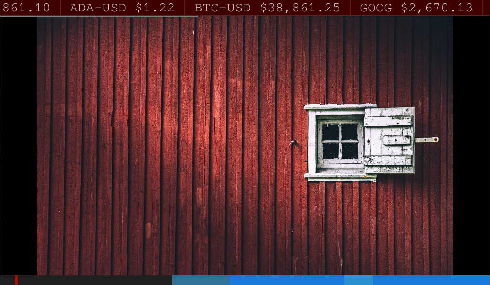
Weather
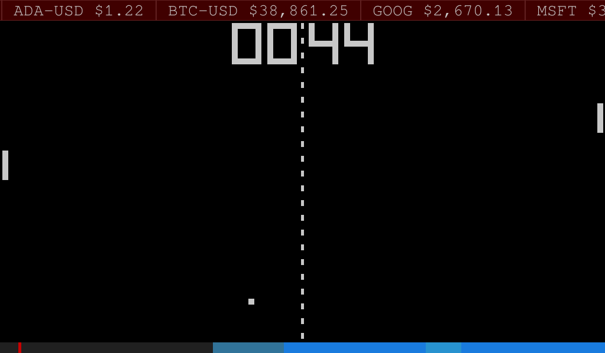
Analog Clock
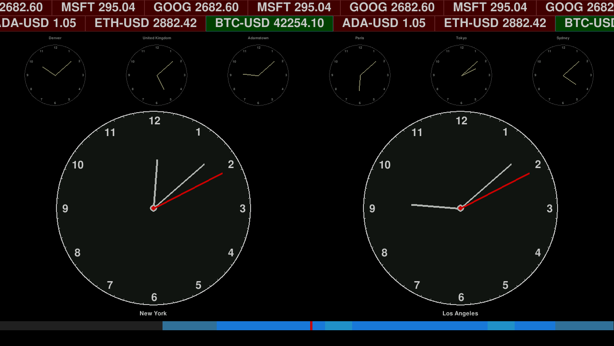
Digital Clock
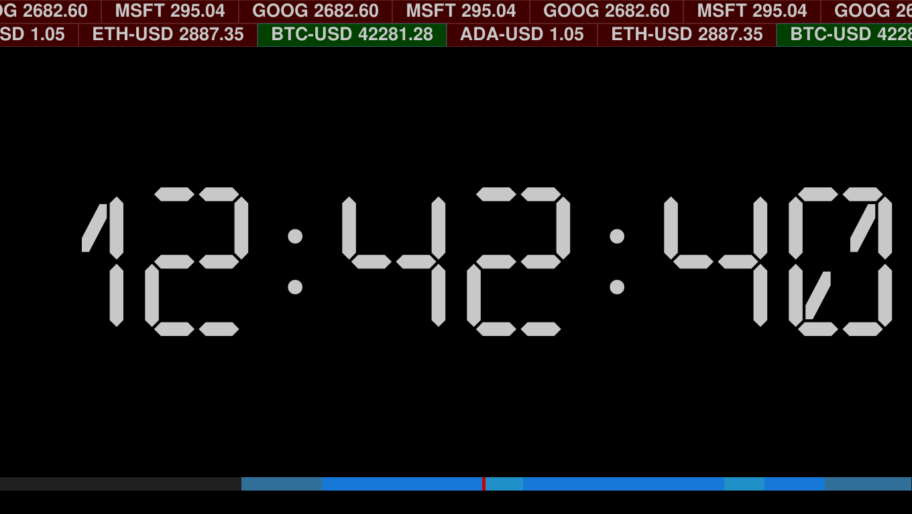
Conways Game of Life
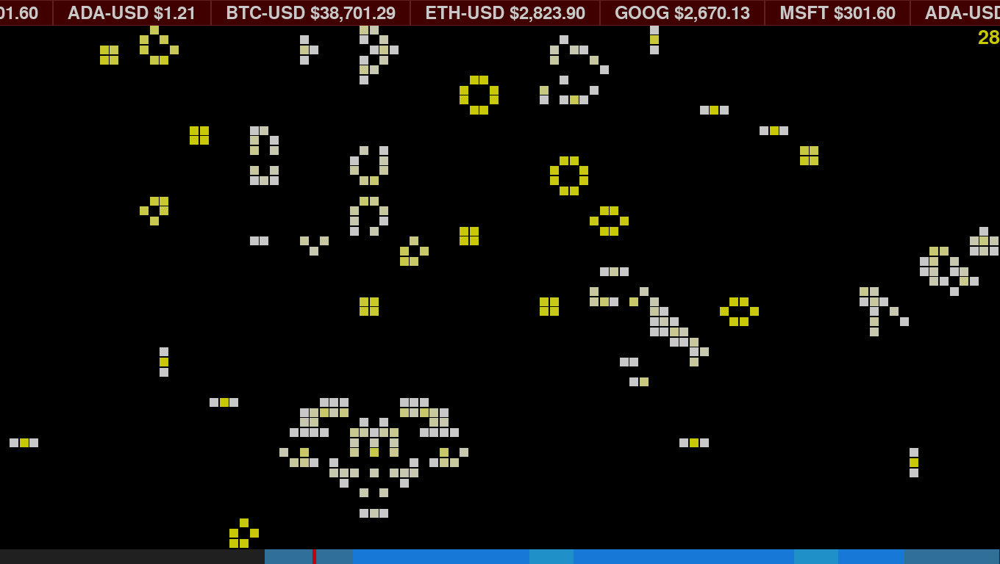
Now Playing (Spotify)
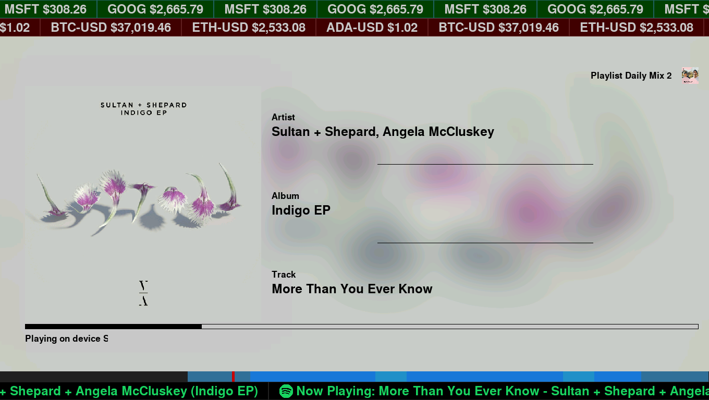
News Feed
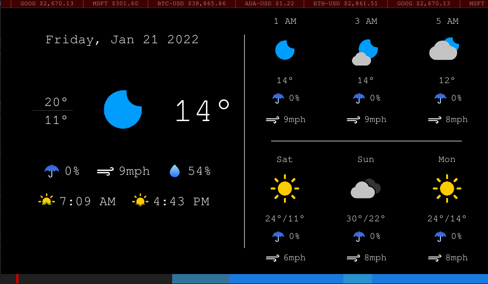
Pi-Hole Information
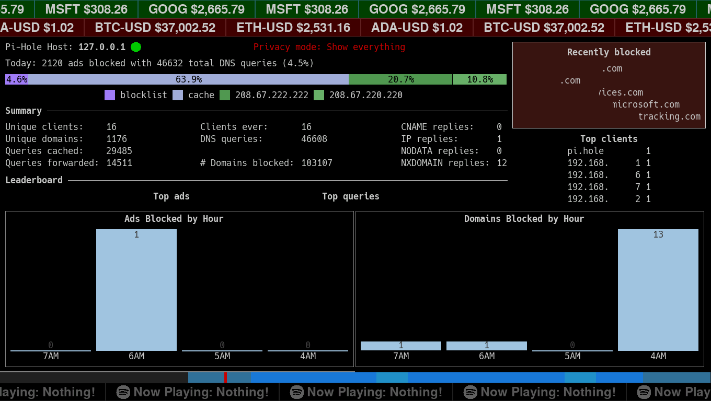
System Information (note that you can remove the top and bottom widgets per screen, as shown here)
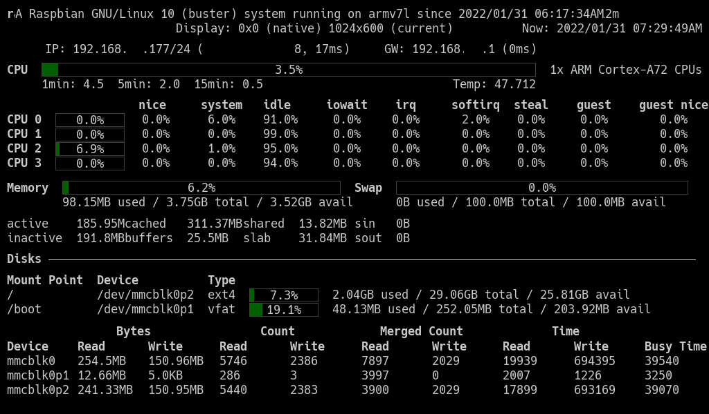
Multiple widgets on the top and bottom (that can be independently turned on and off):
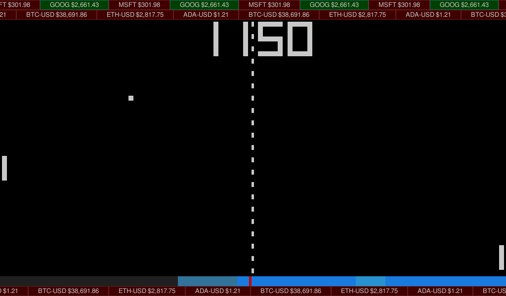

# Requirements
- python3
- various python3 modules:
  - **pillow** is for the Picture Viewer and Now Playing plugins
  - **spotipy** is for the Now Playing and Now Playing Ticker plugins
  - **feedparser** is for the News Feed plugin
  - **pytz** is for the World Clock plugin
  - **requests** is for the Ticker, Pi-Hole, News Feed, Now Playing, System Info and OpenWeather Maps plugins. Probably already included on your system.
  - **geopy** is for the Weather plugin, to get the latitude and longitude from the city name
  - **yfinance** is for the Ticker plugin
    - **numpy** yfinance requires this and is known to give Raspberry Pi folks trouble during installation. Follow the instructions below and you should be ok.
- python3 pygame module and pygame's SDL2 bindings

# Installation
1. Log into your Raspberry Pi console.
2. You may have to install git
````commandline
sudo apt install git
````
3. Clone this git repository
````commandline
git clone https://github.com/nomachinez/pidisplay.git
````
4. Edit the ./pidisplay/config.ini file to your liking.  Some notes about the config.ini file(s):
   * All settings in each of the plugins can be overridden in the main config.ini file.
   * Each plugin section in the main config.ini file needs a class setting pointing to the python class name for that plugin. The section name can be anything you want, but the class setting is not optional and must match exactly to the python class name for that plugin.
   * Take a look at the config.ini file in each plugin directory for all the options available to you for each plugin.
   * Some plugins (e.g., openweathermap, nowplaying) require you to enter an api key or client id/username, which should be entered in the ./pidisplay/config.ini file.
   * Widgets need a widget_location = top or widget_location = bottom in the main config.ini file for it to show up on your display.
   * Plugins will be loaded and cycled through in the order present in the main config.ini file.
   * If you want a particular plugin to stay on the screen longer/shorter than the default "autoswitch_timer" value, enter autoswitch_timer = # in the section for that plugin with the number of seconds you want.
   * You can load a plugin multiple times by adding it multiple times in the main config file. Just make sure to name it something different. The options can be managed separately as well (e.g., 2 tickers with different symbols and speeds). See [below](#Instructions-for-adding-multiples-of-the-same-plugin) for an example.
   * To disable a plugin, remove the settings or comment the settings out in the main config.ini file.

5. The settings in the main config.ini file are great for my [1360x768 7" screen](https://www.amazon.com/Eviciv-Portable-Monitor-Display-1024X600/dp/B07L6WT77H). You may want to adjust them if your screen is different.  There are many settings that can be overridden in here but the ones to look at first are:

**(BE SURE to edit the main config.ini file, NOT the config.ini file in each plugin folder. It is there for your reference/documentation only and can/will be overwritten when you upgrade)**
- __Main config.ini__ 
  - Set fullscreen/resolution
  - Set system font
  - Set default widget height
  - Set the default autoswitch timer delay (how long to wait before switching to the next module)
- __pidisplay/plugins/ticker__
  - Set the stock/crypto tickers to track
- __pidisplay/plugins/newsfeed__
  - Configure any RSS feeds you want. You can add as many as you want, and it will show only the latest number (across all feeds) that will fit on your screen.
  - If you [configure a Slack webhook url](https://api.slack.com/messaging/webhooks), when you click on a news article it will send you the link to your Slack channel.  This is very useful if you find something you want to read and want to send the url to your phone or computer.
- __pidisplay/plugins/picture_viewer__
  - Set the slideshow delay
  - Set your picture folder if you already have your pictures in another folder 
- __pidisplay/plugins/pongclock__
  - Nothing of note in here unless you want to mess around with the colors
- __pidisplay/plugins/clok__
  - Configure the time periods when you are most active and choose a series of colors that represent your activity level for that time period.
- __pidisplay/plugins/gameoflife__
  - Nothing of note in here unless you want to mess around with the world size and colors.
- __pidisplay/plugins/openweathermap_forecast__
  - Your openweathermap api key ([sign up for a free account](https://openweathermap.org/api) and configure a [new API key](https://home.openweathermap.org/api_keys))
  - The longitude/latitude of the location for which you want to track weather.
- __pidisplay/plugins/nowplaying and pidisplay/plugins/nowplaying_ticker__
  - Update your Spotify client_id and username
- __pidisplay/plugins/pihole__
  - Update the ip address of your Pi-Hole server, if it's not the same as the one running PiDisplay
- __pidisplay/plugins/systeminfo__
  - Update the font size for your screen
6. The yfinance python3 module requires the numpy python3 module which requires you to first install the libatlas3-base package on your computer. Also, we're going to need to install some python modules and pygame requires SDL2, so let's install them now:
````commandline
sudo apt install libatlas3-base python3-pip python3-pygame python3-sdl2
````
7. Install python modules to support the included plugins (required if you elect to use the respective module):
````commandline
sudo pip3 install pillow spotipy feedparser psutil requests yfinance pytz geopy
````
8. In order to use Spotify you need to add the app to your Spotify account and generate an access token:
    * 1\) In the Spotify Developer Dashboard (https://developer.spotify.com/dashboard/applications) and log in.
    * 2\) Click Create an app on the top-left
    * 3\) In the Create an app dialog, set an app name and app description (these can be anything you want, but be descriptive):
        - App name: PiDisplay
        - App description: Display your Now Playing information on your Pi!
          (note: you must agree to the terms to continue)
    * 4\) Click Create
    * 5\) In your new PiDisplay app settings (still in the Spotify Developer web portal), copy the Client ID. You will need that.
    * 6\) Now update the Redirect URI for your PiDisplay app (still in the Spotify Developer web portal) by clicking Edit Settings
    * 7\) In the Edit Settings dialog, in the Redirect URIs section, enter "http://localhost:8888/callback" and click Add
    * 8\) Click Save
    * 9\) Now, back on your computer or PiDisplay computer, run the get_spotify_token.py:
    ````commandline
    python3 ./pidisplay/get_spotify_token.py
    ````
    * 10\) Enter your Client ID (from step 5) and your username when prompted.
    * 11\) The script will give you a URL.  Go to that URL and click Agree to allow the app to have access to your account.
    * 12\) Once you click agree, you will be redirected to http://localhost:8888/<something>, which will not work in your browser.  This is ok.  Copy the new URL and paste it back into the script when prompted.
   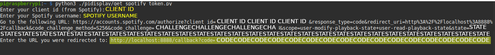
    * 13\) If you are running this on a system other than the one you will use to run PiDisplay, copy the ".cache-\<username>" file over to the system where you will run PiDisplay, in the directory from which you will run it (e.g., /home/pi).

10. Run it!
````commandline
python3 pidisplay/pidisplay.py
````
10. (Optional) Configure your Raspberry Pi to log in automatically and automatically start PiDisplay
```commandline
sudo raspi-config
```
   * Choose option "1 System Options"
   * Choose option "2 S5 Boot / Auto Login"
   * Choose option "B2 Console Autologin"
   * Choose "\<Finish>"
   * Don't reboot yet.

Now add the startup to your .bashrc
````commandline
# Only run if we are logging in locally not through SSH
TTY=`tty`
if [[ "$TTY" =~ ^/dev/tty[0-9]+$ ]]; then
  python3 pidisplay/pidisplay.py >>out.txt 2>>out2.txt
fi

````

Reboot
````commandline
reboot
````

# Upgrade instructions
1) Make sure to update/install the modules in steps 6 and 7, just in case they changed. Just re-run the commands.
2) Rename your config.ini file to config.ini.backup
3) Get the latest version by rerunning the git clone command in step 3.
4) Review any changes to the config.ini file compared to your backup
5) Add/Update the config settings in config.ini from your config.ini.backup file 

# Instructions for adding multiples of the same plugin
6) Open up the main config.ini file in ./pidisplay/config.ini
7) Copy the section you want to duplicate and paste it back in, so now you have 2 of them.
8) Change the section title of the second one to something different
9) Modify any settings you choose but keep the "class" setting the same.

e.g.
````commandline
.....SNIP......

[ticker]
class = Ticker
tickers = ["msft", "goog"]
speed = 1
widget_location = top

......SNIP......

````
becomes something like
````commandline
......SNIP......

[ticker1]
class = Ticker
tickers = ["msft", "goog"]
speed = 1
widget_location = top

[ticker2]
class = Ticker
tickers = ["ada-usd", "eth-usd", "btc-usd"]
speed = -2
widget_location = bottom

......SNIP......
````

# TODO
- Fix the paddles in the pongclock. The paddles track the ball correctly only about 95% of the time.

# Changelog
20-02-2022
- Cleaned up errant print()s
- Bugfixes in the nowplaying and ticker modules that sometimes caused unhandled exceptions.

15-02-2022
- Added location to weather plugin
- Add moon phase to weather
- Added 12/24-hour clock option to the digital clock
- Cleaned up code
- Fixed a couple bugs
- Made the paddles in PongClock work a little better

13-02-2022
- Added the WorldClock plugin
- Added Digital Clock plugin
- Fixed a few bugs

01-02-2022
- Redesigned/Matured configuration system
- Redesigned/Matured plugin system
- Added Spotify Now Playing ticker widget
- Added Spotify Now Playing module
- Made the picture viewer a little fancier
- Added System Info plugin
- Added Pi-Hole Info plugin
- Made it so the height of each widget bar can be customized individually
- Made it so each full screen plugin can have its own auto switch delay
- Turn on/off the widgets per full screen plugin (e.g., optionally don't show the widgets when there's a lot of other stuff on the screen, like on the System Info screen, or on the Picture Viewer screen when you want a nice picture frame)
